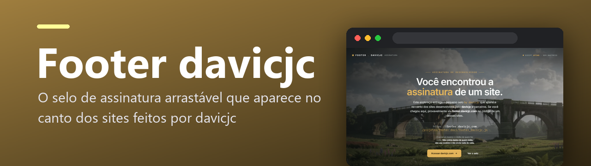
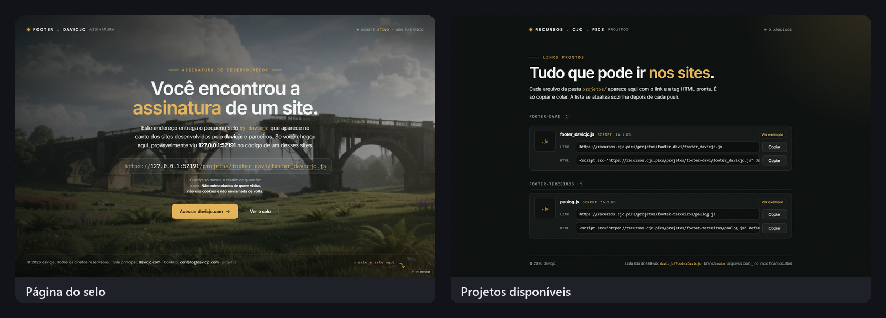

<p align="center">
  
</p>

<p align="center">
  
  <a href="https://footer.davicjc.com/"></a>
  
  
  
  
</p>

<p align="center">O selo de assinatura arrastável que aparece no canto dos sites feitos por davicjc — e a página que explica o que ele é.</p>


<p align="center">
  
</p>

### 📸 Telas do sistema

<p align="center">
  
</p>

---

Scripts e arquivos do **davicjc** para os sites dos clientes, servidos em https://recursos.cjc.pics/ (Cloudflare Pages). Hoje: o footer de assinatura, que mostra `by davicjc` no canto do site e, ao clicar, abre um card com o portfólio.

## Estrutura

| Caminho | O que é |
|---|---|
| `index.html` | Página inicial do domínio: explica o que é para quem o encontra no código de um site |
| `projetos.html` | Lista automática de tudo em `projetos/`, com link e tag HTML prontos para copiar e um exemplo funcionando de cada arquivo |
| `assets/` | Arquivos das páginas: `index.css`, `index.js`, `projetos.css`, `projetos.js`, `favicon.svg` e `fundo.mp4` |
| `projetos/` | Uma subpasta por projeto. Arquivos e pastas com `_` no início são internos e não aparecem no `projetos.html` |
| `projetos/footer-davi/footer_davicjc.js` | Footer "by davicjc" |
| `projetos/footer-terceiros/<parceiro>.js` | Footers de parceria (gerados, não editar à mão) |
| `assets/gerar-parcerias.js` | Cria os footers de parceria copiando o footer do Davi e trocando os nomes |
| `functions/projetos/[[caminho]].js` | Contador de carregamentos no servidor (ver abaixo) |
| `teste/index.html` | Teste com sites simulados (claro, escuro, foto, CSS agressivo) |
| `footer_cjc.js` | **Legado**: usado por sites antigos via jsDelivr. Só carrega o footer do Davi (não tem código próprio). Não apagar |
| `rules.md` | O que nunca pode entrar nos scripts, para não manchar o domínio |

## Usar em um site

A lista completa, com botão de copiar, fica em https://recursos.cjc.pics/projetos.html e se atualiza sozinha a cada push.

```html
<!-- footer do davicjc -->
<script src="https://recursos.cjc.pics/projetos/footer-davi/footer_davicjc.js" defer></script>

<!-- footer da parceria com o PauloG -->
<script src="https://recursos.cjc.pics/projetos/footer-terceiros/paulog.js" defer></script>
```

## Alterar o footer

1. Editar `projetos/footer-davi/footer_davicjc.js`.
2. Rodar `node assets/gerar-parcerias.js`. Ele recria os footers de parceria com a mesma mudança. O `footer_cjc.js` legado não precisa de nada: ele já carrega o footer do Davi.
3. Abrir `teste/index.html` no navegador e conferir.
4. Revisar a lista do `rules.md` antes do push, porque o push publica em todos os sites.

**Novo parceiro:** adicionar em `PARCEIROS` no `assets/gerar-parcerias.js` (Davicjc sempre primeiro) e rodar o passo 2. O arquivo sai em `projetos/footer-terceiros/<nome>.js`.

## Publicação (Cloudflare Pages)

- Projeto ligado a este repositório, branch `main`.
- Framework: nenhum. Comando de build: vazio. Diretório de saída: raiz (deixe vazio ou `/`).
- Domínio personalizado: `recursos.cjc.pics`.
- Tudo no repositório fica acessível pelo domínio.

## Contador de carregamentos

A função `functions/projetos/[[caminho]].js` roda no servidor do Cloudflare Pages. A cada arquivo de `projetos/` entregue, ela grava **site de origem (só o domínio), arquivo e data/hora** num banco D1. Nada sobre quem visita é guardado. Sem o banco ligado, os arquivos são entregues normalmente, só não conta.

### Configurar (uma vez, no painel do Cloudflare)

1. **Criar o banco:** menu *Armazenamento e bancos de dados* (Storage & Databases) → **D1** → **Criar banco de dados**, com o nome `recursos-contador`.
2. **Criar a tabela:** abra o banco → aba **Console** → cole e execute:

   ```sql
   CREATE TABLE carregamentos (
     id INTEGER PRIMARY KEY AUTOINCREMENT,
     quando TEXT NOT NULL,
     arquivo TEXT NOT NULL,
     site TEXT
   );
   CREATE INDEX idx_carregamentos_quando ON carregamentos (quando);
   ```

3. **Ligar o banco ao site:** projeto no *Workers e Pages* → **Configurações** → **Vinculações** (Bindings) → **Adicionar** → **Banco de dados D1**. Nome da variável: `DB` (exatamente assim). Banco: `recursos-contador`.
4. **Publicar de novo:** faça um push ou, em *Implantações*, use **Tentar implantar novamente**. A vinculação só vale a partir do próximo deploy.

### Ver os números (aba Console do banco)

Quantas vezes cada arquivo foi carregado, por site:

```sql
SELECT site, arquivo, COUNT(*) AS vezes, datetime(MAX(quando), '-3 hours') AS ultimo_horario_brasilia
FROM carregamentos
GROUP BY site, arquivo
ORDER BY vezes DESC;
```

Carregamentos por dia (horário de Brasília):

```sql
SELECT date(quando, '-3 hours') AS dia, site, arquivo, COUNT(*) AS vezes
FROM carregamentos
GROUP BY dia, site, arquivo
ORDER BY dia DESC, vezes DESC;
```

Últimos 50 carregamentos:

```sql
SELECT datetime(quando, '-3 hours') AS horario_brasilia, site, arquivo
FROM carregamentos
ORDER BY id DESC
LIMIT 50;
```

`site` vazio significa que o pedido veio sem origem (acesso direto ao arquivo, robôs ou site que esconde a origem).

## Sites antigos

Sites antigos usam `cdn.jsdelivr.net/gh/davicjc/FooterDavicjc@main/footer_cjc.js`, que lê o `footer_cjc.js` da raiz deste repositório. O arquivo fica mantido porque não se sabe quais sites ainda usam o link. Ele é só um carregador: busca o `projetos/footer-davi/footer_davicjc.js` em `recursos.cjc.pics` (e, se falhar, pelo jsDelivr). Por passar pelo `recursos.cjc.pics`, esses sites também aparecem no contador. Ao mexer num site antigo, troque a tag pela nova (veja o `projetos.html`).

---

<p align="center">Feito por <a href="https://github.com/Davicjc">Davi Castro</a> · <a href="https://davicjc.com">davicjc.com</a></p>
